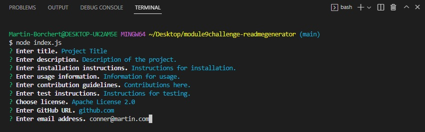

# Readme Generator

## Description

A command line application that allows the user to input information about their project and then generates a Markdown readme file using that information. The application renders appropriate pieces of information as links, and renders a badge corresponding to the selected license.

[Demo video.](https://drive.google.com/file/d/1naLD4W9-0Ws3wproR3GEmXzjN88NU9y2/view?usp=sharing)
